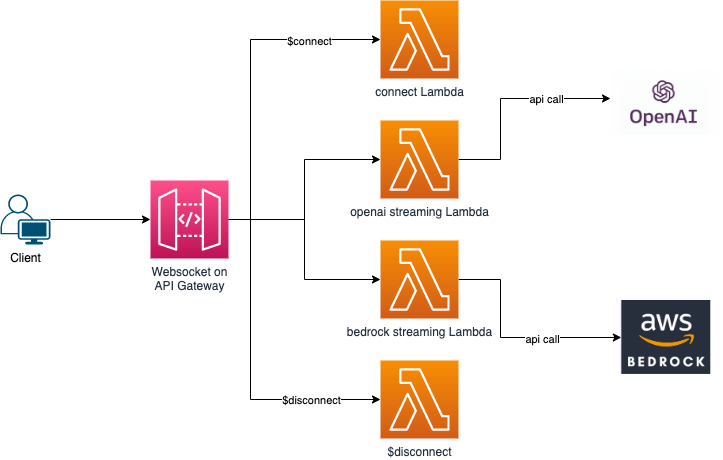
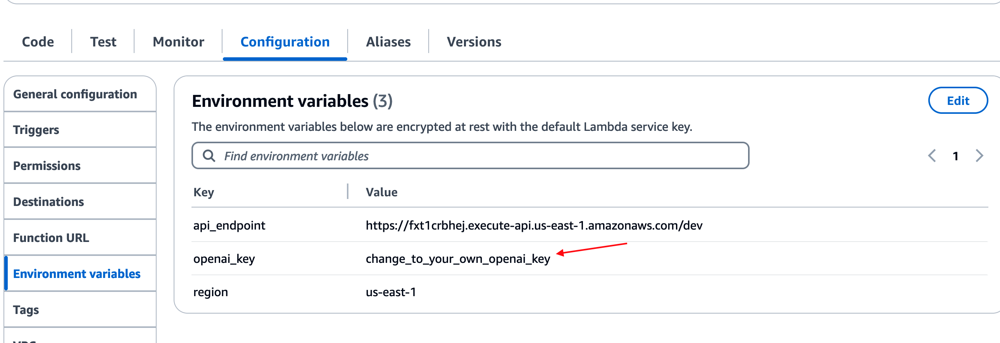
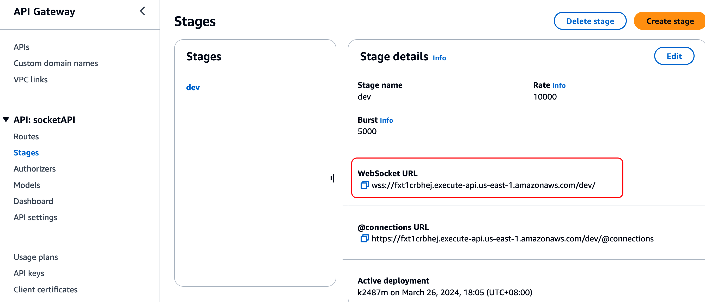
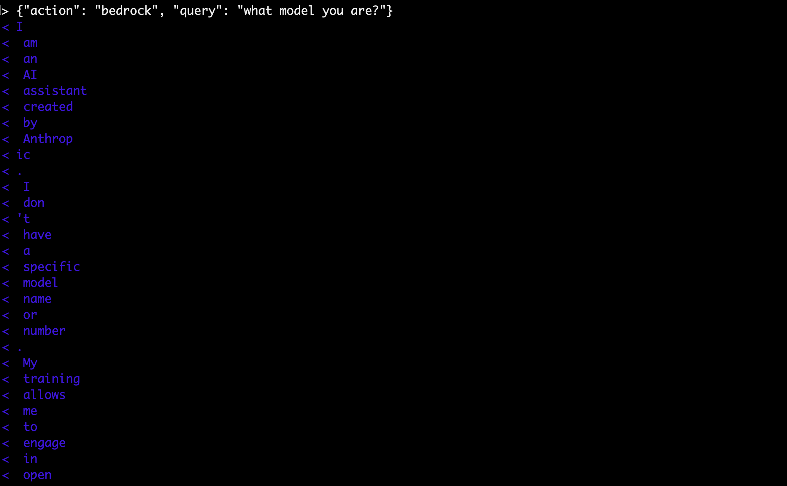
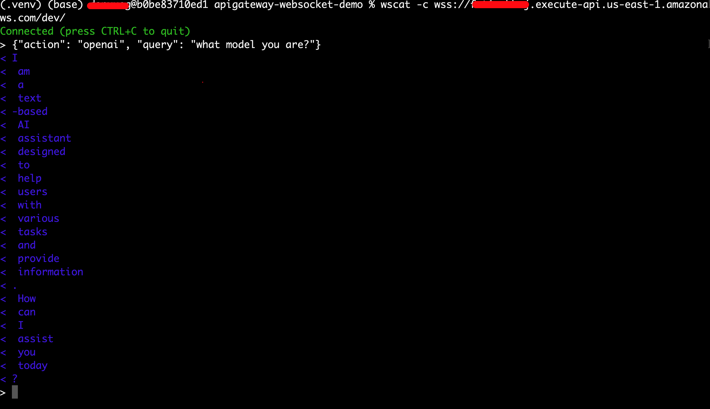

# Real-Time AI-Powered WebSocket APIs
This repository provides a demonstration of building real-time AI-powered WebSocket APIs using AWS API Gateway, Lambda to connect AWS Bedrock and OpenAI. The setup enables bidirectional communication between clients and the backend, with AI processing performed by AWS Bedrock and OpenAI.

## Architecture Overview



The architecture consists of the following components:

- AWS WebSocket API Gateway: Serves as the entry point for WebSocket communication, facilitating real-time, bidirectional communication between clients and the backend.
- AWS Lambda Functions:
    - Connect Lambda: Handles the initial connection request and establishes the WebSocket connection.
    - Streaming OpenAI Lambda: Processes client requests, calls the OpenAI streaming API, and sends AI-powered responses back to clients.
    - Streaming Bedrock Lambda: Processes client requests, calls the Bedrock streaming API, and sends AI-powered responses back to clients.
    - Disonnect Lambda: Handles the connection tear down.
- OpenAI API: Provides OpenAI capabilities and generates responses based on client queries.
- Bedrock API: Provides Bedrock Claude3 Sonnet capabilities and generates responses based on client queries.


## Getting Started
To get started with the project, follow the steps outlined below:

### Prerequisites
An AWS account
Basic knowledge of AWS services, including API Gateway, Lambda, and CloudFormation
An OpenAI API key (sign up on the OpenAI website if you don't have one) and AWS Bedrock Claude3 model access

### Installation and Setup
1. clone the code repository to your local machine
2. install AWS SAM tool (https://docs.aws.amazon.com/serverless-application-model/latest/developerguide/install-sam-cli.html)
3. move to local machine's code directory and run
```jsonc
 sam deploy --guided --capabilities CAPABILITY_NAMED_IAM
 ```
4. accept sam output options and finally deploy the stack
5. go to your AWS console and find streaming-openai lambda function's configuration and input your openai key:

6. go to your AWS console API Gateway service and find this newly created api in dev stage as following:

7. use wscat -c to connect to your websocket endpoint (https://github.com/websockets/wscat) 
8. send message with format : {"action":"openai or bedrock", "query":"the prompt you want to set"}
9. see following 2 examples:


10. use:
```jsonc
sam delete
```
to delete the whole stack

### Additional Customizations
Feel free to explore and customize the project further based on your requirements:
- Modify the Lambda function code to enhance or modify the AI processing logic.
- Implement additional functionalities, such as error handling or security measures.
- Integrate with other AI services or APIs to extend the capabilities of the WebSocket API.

## Contributing
Contributions to this project are welcome! If you have any ideas, improvements, or bug fixes, please open an issue or submit a pull request.

## Resources
- AWS Serverless Application Model (SAM) Documentation
- AWS CloudFormation Documentation
- AWS Lambda Documentation
- OpenAI API Documentation
- WebSocket API Gateway Documentation

Please refer to the above resources for detailed documentation on AWS services and the OpenAI API.

## Acknowledgments
This project was inspired by the need for real-time AI-powered communication and the capabilities offered by AWS services and OpenAI.
We would like to express our gratitude to the developers and contributors of the AWS SDKs, OpenAI Python library, and related open-source projects that facilitated the implementation of this project.


